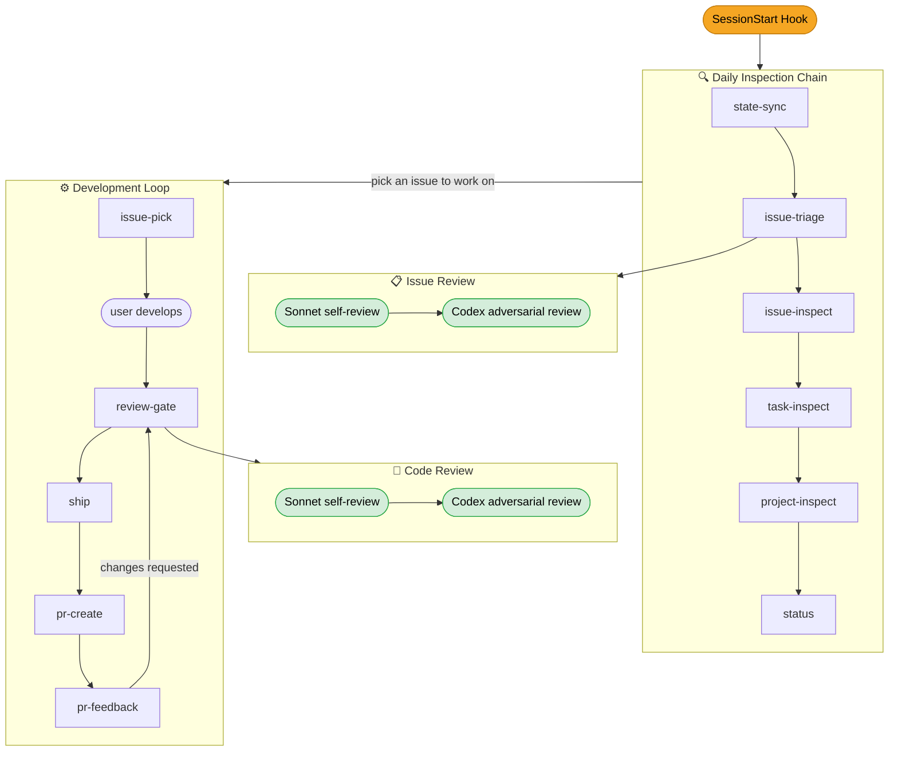

# teamdev

A Claude Code plugin that automates GitHub-based team development workflows. It maintains a local state file (`teamdev-state.json`) that mirrors your projects, tasks, and issues with live GitHub data, and provides a daily routine of inspection, development, review, and shipping.

## Concepts

- **Project** — a tracked GitHub repository (`owner/repo`). Status: `ongoing | finished | stale`
- **Task** — a logical grouping of related issues (e.g., "implement-auth"). Tagged as `feat`, `bugfix`, `refactor`, etc. Status: `ongoing | finished | stale`
- **Issue** — a GitHub issue, the smallest unit of work. Status: `ongoing | finished`

Staleness kicks in after 7 days of inactivity on a finished task or project.

## Daily Workflow



1. **Session starts** — the `SessionStart` hook asks whether to run the daily inspection (yes/no). If yes, it runs the inspection chain: `state-sync` → `issue-triage` → `issue-inspect` → `task-inspect` → `project-inspect` → `status`
2. **Pick an issue** — `/teamdev:issue-pick` to select what to work on
3. **Develop** — write your code
4. **Review** — `/teamdev:review-gate` runs a two-phase review (Sonnet self-review + Codex adversarial review)
5. **Ship** — `/teamdev:ship` commits, creates a task branch if the task is complete, and pushes
6. **Create PR** — `/teamdev:pr-create` finds the PR template and opens a pull request
7. **Address feedback** — `/teamdev:pr-feedback` fetches review comments and guides the fix loop
8. **Repeat** steps 3–7 until the PR is approved and merged

## Commands

| Command | Purpose |
|---------|---------|
| `/teamdev:setup` | Initialize the plugin — verify `gh` auth, create state file |
| `/teamdev:help` | Show all available commands and skills |

## Skills

### Inspection Chain

| Skill | Purpose |
|-------|---------|
| `state-sync` | Sync local `teamdev-state.json` with live GitHub issue data |
| `issue-triage` | Discover new assigned issues, validate with double-phase review, assign to tasks |
| `issue-inspect` | Check tracked issues for new comments, closures, and cross-references |
| `task-inspect` | Recalculate task statuses from child issues, flag stale tasks |
| `project-inspect` | Recalculate project statuses from child tasks, flag stale projects |
| `status` | Display formatted tree of all projects, tasks, and issues |

### Development Flow

| Skill | Purpose |
|-------|---------|
| `project-setup` | Create a new project from a GitHub repo, fetch issues, group into tasks |
| `issue-pick` | Present ongoing issues and let the user select one to work on |

### Review & Ship Pipeline

| Skill | Purpose |
|-------|---------|
| `review-gate` | Two-phase code review: Sonnet self-review + Codex adversarial review |
| `ship` | Commit, create task branch, migrate commits, and push |
| `pr-create` | Find PR template, build title/body, and create a pull request |
| `pr-feedback` | Fetch PR review comments and guide the address-feedback loop |

## Hooks

| Hook | Event | Description |
|------|-------|-------------|
| `SessionStart` | New session | Prompts the user with a yes/no question to optionally run the daily inspection chain (state-sync → issue-triage → issue-inspect → task-inspect → project-inspect → status). Skipped entirely if the user declines. |

## Prerequisites

- [GitHub CLI (`gh`)](https://cli.github.com/) installed and authenticated (`gh auth login`)
- A Git repository with issues assigned to your GitHub account

## Installation

```bash
claude --plugin-dir /path/to/teamdev
```

Then run `/teamdev:setup` to initialize the state file and configure your first project.