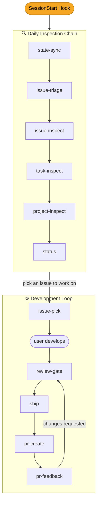

# Teamdev Plugin Design

**Date**: 2026-04-16
**Author**: Fernando Zhu + Claude
**Status**: Approved

## Overview

A Claude Code plugin for git-repo-based teamwork development that tracks projects, tasks, and issues with a structured daily workflow: inspection -> development -> code review -> commit/push -> PR -> PR feedback loop.

## Design Decisions

- **State storage**: Local JSON file (not YAML, not GitHub-only)
- **Platform**: GitHub only (via `gh` CLI)
- **Staleness threshold**: 7 days since last activity
- **Inspection trigger**: Both SessionStart hook + manual skill invocation
- **External dependency**: `codex:adversarial-review` (already installed separately)
- **No commands**: All functionality exposed via skills and hooks
- **No agents**: User will create agents manually

## Data Model

### State File (`teamdev-state.json`)

```json
{
  "projects": [
    {
      "name": "project-name",
      "repo": "owner/repo",
      "status": "ongoing | finished | stale",
      "last_activity": "2026-04-16T12:00:00Z",
      "tasks": [
        {
          "name": "task-name",
          "tag": "feat | bugfix | refactor | ...",
          "status": "ongoing | finished | stale",
          "last_activity": "2026-04-16T12:00:00Z",
          "issues": [
            {
              "number": 120,
              "title": "Short issue title from GitHub",
              "status": "ongoing | finished",
              "last_activity": "2026-04-16T12:00:00Z"
            },
            {
              "number": 231,
              "title": "Another issue title",
              "status": "ongoing | finished",
              "last_activity": "2026-04-15T08:30:00Z"
            }
          ]
        }
      ]
    }
  ]
}
```

### Status Rules

- **Project**: `ongoing` if any task is ongoing; `finished` if all tasks finished; `stale` if finished > 7 days
- **Task**: `ongoing` if any issue is ongoing; `finished` if all issues finished; `stale` if finished > 7 days
- **Issue**: `ongoing` if open on GitHub; `finished` if closed or resolved by commit

## Architecture

### Skills (12)

| # | Skill | Purpose |
|---|---|---|
| 1 | `state-sync` | Read/write/sync local JSON state with GitHub via `gh` CLI |
| 2 | `issue-triage` | Discover new assigned issues, validate (sonnet + codex:adversarial-review), label wontfix or assign to tasks |
| 3 | `issue-inspect` | Check tracked issues for new comments/commits/sub-issues, update statuses |
| 4 | `task-inspect` | Inspect all tasks, derive status from child issues, handle staleness (7d) |
| 5 | `project-inspect` | Inspect all projects, derive status from child tasks, handle staleness (7d) |
| 6 | `project-setup` | Create new project from repo URL, auto-fetch existing issues, bootstrap tasks |
| 7 | `issue-pick` | Present ongoing issues to user via AskUserQuestion, let them select one to work on |
| 8 | `review-gate` | Orchestrate sonnet self-review then codex:adversarial-review, return pass/fail |
| 9 | `ship` | Commit for issue (via commit-commands:commit), create task branch from origin/main, migrate commits (rebase/cherry-pick, never merge), push |
| 10 | `pr-create` | Find PULL_REQUEST_TEMPLATE under .github/, create PR via gh pr create |
| 11 | `pr-feedback` | Fetch PR review comments via gh api, present to user, loop back to dev->review->commit |
| 12 | `status` | Display formatted overview of all projects/tasks/issues |

### Hook (1)

| Hook | Event | Purpose |
|---|---|---|
| `daily-inspection` | SessionStart | Trigger state-sync -> issue-triage -> issue-inspect -> task-inspect -> project-inspect |

### Skill Dependency Graph

```
SessionStart hook (daily-inspection)
       |
       v
  state-sync
       |
       v
  issue-triage (uses sonnet + codex:adversarial-review)
       |
       v
  issue-inspect
       |
       v
  task-inspect
       |
       v
  project-inspect

                    issue-pick
                        |
                    (user develops)
                        |
                    review-gate (uses sonnet + codex:adversarial-review)
                        |
                    ship (uses commit-commands:commit)
                        |
                    pr-create
                        |
                    pr-feedback -> (loop back to review-gate -> ship)
```

## Daily Workflow



### File Structure

```
cc-teamdev-plugin/
├── .claude-plugin/
│   └── plugin.json
├── skills/
│   ├── state-sync/
│   │   └── SKILL.md
│   ├── issue-triage/
│   │   └── SKILL.md
│   ├── issue-inspect/
│   │   └── SKILL.md
│   ├── task-inspect/
│   │   └── SKILL.md
│   ├── project-inspect/
│   │   └── SKILL.md
│   ├── project-setup/
│   │   └── SKILL.md
│   ├── issue-pick/
│   │   └── SKILL.md
│   ├── review-gate/
│   │   └── SKILL.md
│   ├── ship/
│   │   └── SKILL.md
│   ├── pr-create/
│   │   └── SKILL.md
│   ├── pr-feedback/
│   │   └── SKILL.md
│   └── status/
│       └── SKILL.md
├── hooks/
│   └── hooks.json
├── docs/
│   └── plans/
└── startup_prompt.md
```
